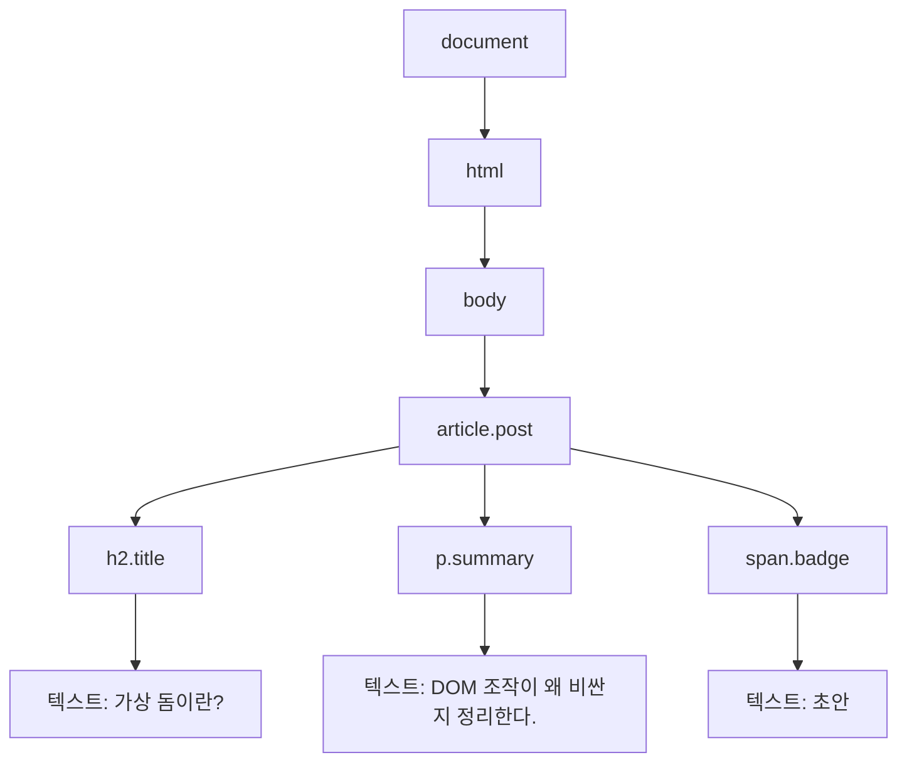
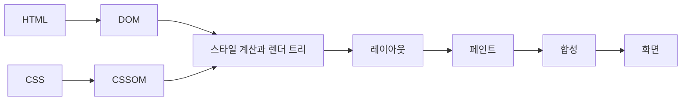

## 📖 들어가며

서버에서 받은 HTML과 CSS는 아직 문자열일 뿐이다. 브라우저는 이 문자열에서 문서 구조와 스타일을 읽고, 각 요소의 크기와 위치를 계산한 다음 화면에 픽셀로 그린다.

[가상 돔 글](/blog/react-virtual-dom)에서 DOM이 바뀌면 브라우저가 그 결과를 다시 화면에 반영해야 한다고 설명했다. 리액트가 실제 DOM 변경을 줄이려는 이유를 이해하려면 그 뒤에서 브라우저가 어떤 일을 하는지 먼저 알아야 한다.

HTML과 CSS를 받아 첫 화면의 픽셀을 표시하기까지 반드시 거치는 경로를 **Critical Rendering Path(핵심 렌더링 경로)** 라고 한다. 이 글에서는 최적화 방법보다 그 경로에서 무슨 일이 일어나는지에 집중한다.

실제 브라우저 내부 구현은 렌더링 엔진마다 다르고 각 작업이 항상 하나씩 직렬로 실행되는 것도 아니다. HTML을 읽는 동안 CSS와 자바스크립트를 내려받는 것처럼 여러 작업이 겹쳐서 진행된다. 아래 여섯 단계는 전체 흐름을 이해하기 쉽게 나눈 설명이다.

## 렌더링 6단계

### 1. HTML 파싱 → DOM 트리

브라우저는 HTML을 위에서부터 읽으며 **파싱(Parsing)**한다. 바이트를 문자로 해석하고, 문자를 `<div>` 같은 토큰으로 나눈 뒤, 토큰으로 노드를 만들어 포함 관계에 따라 연결한다. 그 결과가 **DOM(Document Object Model) 트리**다.

```html
<body>
  <article class="post">
    <h2 class="title">가상 돔이란?</h2>
    <p class="summary">DOM 조작이 왜 비싼지 정리한다.</p>
    <span class="badge">초안</span>
  </article>
</body>
```

태그 하나가 여러 정보를 뭉친 노드가 되는 것은 아니다. `<h2>`는 요소 노드가 되고 그 안의 `가상 돔이란?`은 별도의 텍스트 노드가 된다. `class="title"`은 `h2` 요소에 연결된 속성이지, `h2` 아래에 매달리는 자식 노드는 아니다.

아래 그림은 이 HTML에서 요소와 텍스트가 어떤 부모·자식 관계를 이루는지 보여주는 설명용 개념도다.


++
이 그림에는 요소와 텍스트 노드만 표시했다. `class` 같은 속성은 각 요소에 연결되어 있지만 자식 노드처럼 그리지 않았다.

### 2. CSS 파싱 → CSSOM

브라우저는 `<link>`로 불러온 스타일시트와 `<style>` 안의 CSS도 파싱한다. CSS 규칙을 브라우저가 읽고 수정할 수 있는 객체 구조로 만든 것이 **CSSOM(CSS Object Model)**이다.

```css
body {
  padding: 24px;
}

.title {
  font-size: 20px;
}

.summary {
  color: gray;
}

.badge {
  display: none;
}
```

CSSOM을 DOM처럼 선택자가 위아래로 연결된 트리라고 생각하면 헷갈리기 쉽다. `body` 규칙 아래에 `.title` 규칙이 자식으로 붙는 것이 아니라, 브라우저가 스타일시트의 규칙과 캐스케이드를 바탕으로 각 DOM 요소에 적용할 최종 스타일을 계산한다.

여기서 자주 나오는 표현이 **CSS는 렌더링을 차단한다(render-blocking)**는 말이다. 현재 화면에 필요한 스타일시트가 준비되지 않으면 브라우저는 요소의 최종 스타일을 확정할 수 없다. 그래서 렌더 트리 이후의 레이아웃과 페인트를 미루고 CSS를 기다린다.

그렇다고 외부 CSS를 내려받는 동안 HTML 파싱까지 바로 멈추는 것은 아니다. HTML 파싱과 DOM 생성은 계속될 수 있고, CSS가 준비될 때까지 첫 화면 표시가 기다리는 것이다. 다만 뒤에 있는 일반 스크립트가 앞서 발견된 스타일시트를 기다리면, 그 스크립트 때문에 HTML 파싱까지 간접적으로 멈출 수 있다.

### 3. 스타일 계산과 렌더 트리

브라우저는 DOM의 요소에 CSS 규칙을 맞춰 보고 캐스케이드와 상속을 계산한다. 이렇게 정해진 계산 스타일과 화면 배치에 참여하는 노드를 묶은 결과를 보통 **렌더 트리(Render Tree)**라고 설명한다.

- `display: none`인 요소는 레이아웃에 참여하지 않으므로 렌더 트리에서 빠진다.
- `visibility: hidden`인 요소는 보이지 않지만 자리는 차지하므로 레이아웃에 참여한다.
- `<head>`, `<script>`, `<meta>`처럼 시각적 상자를 만들지 않는 요소도 화면 배치에서 제외된다.

앞의 예시에서는 `.badge`에 `display: none`이 적용되므로 `span.badge`가 레이아웃에 참여하지 않는다. 렌더 트리는 DOM을 그대로 복사한 트리가 아니라, 화면을 배치하고 그리는 데 필요한 정보만 추린 결과다.

DOM과 CSSOM이 화면으로 이어지는 흐름을 단순화하면 다음과 같다.



이 그림은 각 단계의 입력과 출력만 보여준다. 실제 브라우저에서는 리소스 다운로드와 파싱이 겹쳐서 진행되고, 화면이 바뀔 때마다 모든 단계를 처음부터 다시 실행하는 것도 아니다.

### 4. 레이아웃(Layout)

렌더 트리에 어떤 요소가 참여하는지 정해졌다면, 이제 각 요소가 뷰포트 안에서 어디에 놓이고 얼마나 큰지 계산해야 한다. 이 과정이 **레이아웃(Layout)**이다.

`%`, `em`, `vw`처럼 주변 요소나 뷰포트에 따라 달라지는 값도 이 단계에서 실제 배치에 사용할 크기로 계산된다. 앞의 예시에서는 `body`의 `padding: 24px` 때문에 `h2`와 `p`가 바깥쪽에서 24px 떨어지고, 글꼴과 내용에 따라 각 요소의 높이가 정해진다.

처음 위치와 크기를 계산하는 일을 레이아웃이라고 하고, DOM이나 스타일이 바뀐 뒤 다시 계산하는 일을 **리플로우(Reflow)**라고 구분해서 부르기도 한다. 둘은 같은 종류의 계산을 가리킨다.

### 5. 페인트(Paint)

레이아웃으로 위치와 크기가 정해지면 브라우저는 텍스트, 배경색, 테두리, 그림자 등을 어떤 순서로 그릴지 기록한다. 이후 이 그리기 명령을 실제 픽셀로 바꾸는 래스터화가 이어진다. 이 글에서는 이 과정을 묶어서 **페인트(Paint)** 단계라고 부르겠다.

DOM이나 스타일이 바뀌어 이 작업을 다시 하는 것을 **리페인트(Repaint)**라고 한다. 색상처럼 요소의 크기와 위치를 바꾸지 않는 속성은 새로운 레이아웃 없이 페인트부터 다시 진행할 수 있다.

브라우저는 필요하다고 판단한 요소를 별도의 합성 레이어로 나누기도 한다. `transform`, `will-change`, 고정된 요소 등이 레이어 승격에 영향을 줄 수 있지만, 특정 속성을 썼다고 항상 별도 레이어가 만들어지는 것은 아니다.

### 6. 합성(Compositing)

마지막으로 브라우저는 페인트된 레이어를 쌓임 순서에 맞춰 조합한다. 이 과정이 **합성(Compositing)**이다. 합성이 끝난 결과가 디스플레이에 제출되어야 비로소 사용자가 화면을 볼 수 있다.

요소가 이미 별도 레이어에 있고 위치만 바뀌는 경우에는 레이아웃이나 페인트를 다시 하지 않고 합성 단계에서 처리할 수도 있다. 다만 합성 레이어를 만드는 일에도 메모리가 들기 때문에 레이어가 많다고 무조건 빠른 것은 아니다.

지금까지의 흐름을 표로 정리하면 다음과 같다.

| 단계 | 입력 | 결과 |
| --- | --- | --- |
| HTML 파싱 | HTML | DOM 트리 |
| CSS 파싱 | CSS | CSSOM |
| 스타일 계산과 렌더 트리 | DOM + CSSOM | 계산 스타일과 배치에 참여할 노드 |
| 레이아웃 | 렌더 트리 | 각 요소의 위치와 크기 |
| 페인트 | 레이아웃 결과 | 그리기 명령과 픽셀 |
| 합성 | 페인트된 레이어 | 화면에 표시할 최종 결과 |

## 자바스크립트는 HTML 파싱을 어떻게 막을까?

HTML 파서가 `async`, `defer`, `type="module"`이 없는 일반 `<script>`를 만나면 파싱을 멈춘다. 외부 스크립트라면 파일을 내려받고, 실행까지 마친 뒤에야 나머지 HTML을 읽는다. 자바스크립트가 `document.write()`를 호출하거나 이미 만들어진 DOM을 바꿀 수 있어서, 실행 결과를 확인하기 전에는 뒤의 문서 구조를 확정할 수 없기 때문이다.

앞에서 발견한 렌더 차단 스타일시트가 아직 준비되지 않았다면 스크립트 실행도 그 CSS를 기다릴 수 있다. 스크립트가 `getComputedStyle()`처럼 계산된 스타일을 읽거나 레이아웃 값을 요청할 수 있기 때문이다. 이 경우에는 CSS를 기다리는 스크립트가 HTML 파싱까지 붙잡는 모양이 된다.

외부 클래식 스크립트의 기본 동작과 `async`, `defer`를 비교하면 다음과 같다.

| 방식 | 다운로드 | 실행 시점 | 실행 순서 |
| --- | --- | --- | --- |
| 기본 | HTML 파싱을 멈추고 다운로드 | 다운로드 직후 | 작성 순서 |
| `async` | HTML 파싱과 병렬 | 다운로드가 끝나는 즉시 | 보장하지 않음 |
| `defer` | HTML 파싱과 병렬 | HTML 파싱이 끝난 뒤 | 작성 순서 |

```html
<!-- 다른 코드와 의존성이 없는 분석 스크립트 -->
<script async src="analytics.js"></script>

<!-- DOM을 사용하거나 실행 순서가 중요한 앱 코드 -->
<script defer src="app.js"></script>
```

`async` 스크립트도 실행하는 동안에는 메인 스레드를 사용하므로 HTML 파싱이 잠시 멈출 수 있다. `defer`는 외부 클래식 스크립트에서만 의미가 있으며, 모듈 스크립트는 기본적으로 HTML 파싱이 끝난 뒤 실행된다.

그래서 화면에 필요한 CSS는 `<head>`에서 일찍 발견되게 하고, DOM을 사용하는 일반 스크립트에는 주로 `defer`를 붙인다. 스크립트를 `</body>` 바로 앞에 두는 방식도 동작하지만, `defer`를 사용하면 문서에서 리소스를 일찍 발견하면서 HTML 파싱은 막지 않을 수 있다.

## 화면이 바뀌면 어디부터 다시 할까?

지금까지 설명한 것은 페이지를 처음 그리는 흐름이다. 그 뒤 자바스크립트가 DOM이나 스타일을 바꾸면 브라우저는 변경 내용을 화면에 반영해야 한다. 이때 항상 여섯 단계를 처음부터 반복하는 것은 아니며, 영향을 받은 단계만 다시 처리한다.

위치나 크기가 달라지면 레이아웃부터 다시 필요할 수 있고, 색상만 바뀌면 레이아웃 없이 페인트부터 처리할 수 있다. 이미 준비된 합성 레이어의 이동처럼 조건이 맞는 변경은 합성만으로 끝날 수도 있다. 각각의 변경이 어느 범위까지 다시 계산되는지와 강제 동기 레이아웃 문제는 리플로우·리페인트를 따로 공부한 뒤 정리하려 한다.

## 리액트의 렌더·커밋과 어떻게 이어질까?

리액트의 렌더링과 브라우저의 렌더링은 같은 말처럼 보이지만 가리키는 일이 다르다. 리액트는 state가 바뀌면 컴포넌트를 다시 호출하고, 이전 결과와 비교해 실제 DOM에 반영할 변경을 계산한다. 그리고 [커밋 단계](/blog/react-render-and-commit)에서 그 변경을 DOM에 적용한다.

DOM이 바뀐 뒤에는 브라우저가 필요한 스타일 계산, 레이아웃, 페인트와 합성을 수행한다. 변경의 종류에 따라 일부 단계를 건너뛸 수 있으므로, 리액트가 커밋할 때마다 브라우저가 전체 파이프라인을 모두 다시 돈다고 이해하면 안 된다.

## 관련 글

- [가상 돔(Virtual DOM)이란?](/blog/react-virtual-dom) — 리액트가 비교할 UI 트리가 무엇인지
- [렌더 단계와 커밋 단계](/blog/react-render-and-commit) — 리액트가 DOM 변경을 계산하고 반영하는 과정
- [재조정(Reconciliation)이란?](/blog/react-reconciliation) — 이전 트리와 새 트리를 비교하는 규칙

## 참고 문헌

- [MDN - Populating the page: how browsers work](https://developer.mozilla.org/en-US/docs/Web/Performance/Guides/How_browsers_work)
- [MDN - Critical rendering path](https://developer.mozilla.org/en-US/docs/Web/Performance/Guides/Critical_rendering_path)
- [MDN - script 요소](https://developer.mozilla.org/en-US/docs/Web/HTML/Reference/Elements/script)
- [web.dev - Rendering performance](https://web.dev/articles/rendering-performance)
