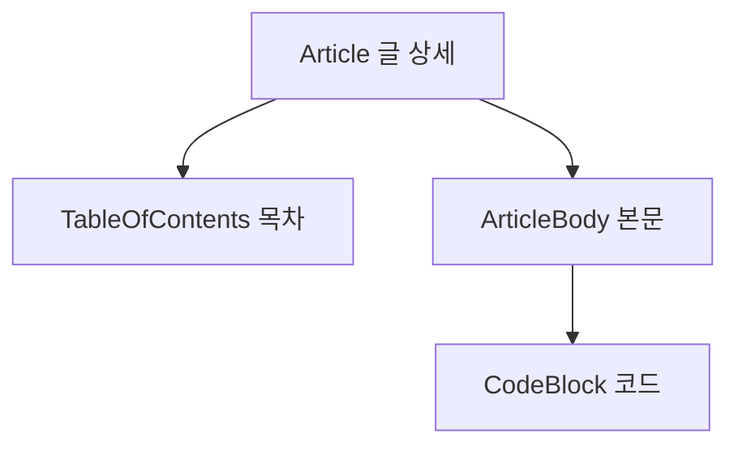
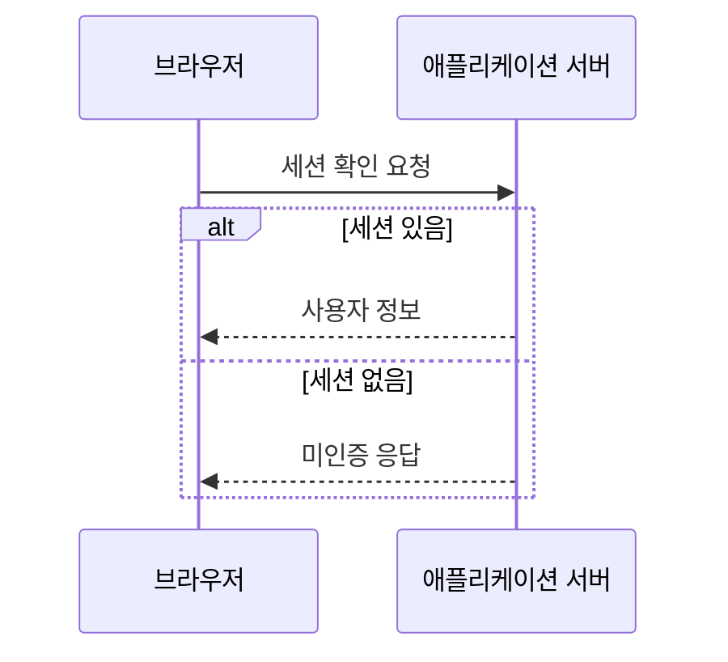

## DP 개념

이 페이지는 실제 작성자의 글이 아닌 **기능 확인용 예제**입니다.

### 작은 문제

부분 문제의 결과를 저장합니다.

## DP 개념

같은 제목도 서로 다른 목차 주소를 가져야 합니다.

```ts
const memo = new Map<number, number>();
memo.set(1, 1);
```

| 확인 항목 | 결과      |
| --------- | --------- |
| 한글      | 표시      |
| 코드      | 구문 강조 |

## 컴포넌트 계층 — 다이어그램 검수

설명용 예시입니다. Article이 목차와 본문을 렌더링합니다.



## 요청과 응답 — 다이어그램 검수

OAuth 전체 프로토콜이 아닌, 브라우저와 서버 사이의 세션 확인을 설명하는 예시입니다.



## 잘못된 문법 — 오류 격리 검수

이 블록만 실패하고 위의 그림과 아래 문장이 유지되어야 합니다.

```mermaid
this is intentionally invalid
```

오류 뒤의 본문도 정상적으로 읽을 수 있습니다.
